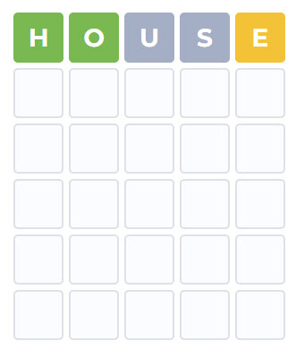
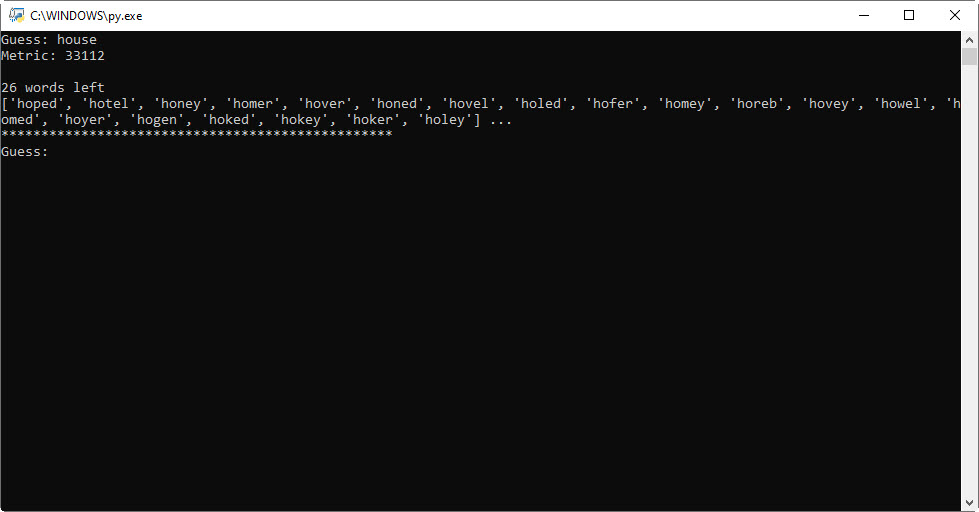

# Wordle-Solver
A simple implementation for a Wordle solving tool

  

## How does it work?
This simple implementation of a wordle solver works by maintaining a pool of possible words, and progressively culling words that are no longer possible based on the feedback metric. The full list of words was taken from https://github.com/dwyl/english-words and then all 5 letter words were filtered out and saved. As the full list of words contains 479,000 words, a lot of these words are very uncommon. In order to present the user with the most likely words, a second source of words was used which had information about the frequency for English speakers. This frequency data was taken from https://www.kaggle.com/datasets/rtatman/english-word-frequency.

Combining these two sources of data allows for the most common english words that are valid to appear at the front of the list, whilst still having a robust list of all possible words.

## How do you use it?
Simply download the folder named "Code" and run "Wordle-Solver.py"

You will be prompted to enter a guess, simply enter your guess into wordle, and then enter the same word into the solver.

Wordle will now provide a metric for how close your guess is to the target word. You can now enter the metric into the solver, where:
* Grey letter = 1
* Yellow letter = 2
* Green letter = 3

For instance, if your initial guess was the following:

You would enter the following information into the solver:

After entering the metric, the solver will say how many possible words are remaining, and return up to 20 of the most common english words that are possibly the target word. The user will now continue to be prompted with a guess and a metric until the target word is found. You can now enter one of the words that the solver returned into wordle, or decide upon your own word to try.

Happy wordling!

## Reverse Wordle Solver
This aims to help the user guess what words another person tried when playing wordle.

For instance, if you had already played and know that the target word is "trees", you can enter the metric that another person has shared and see what possible words they could have tried.
